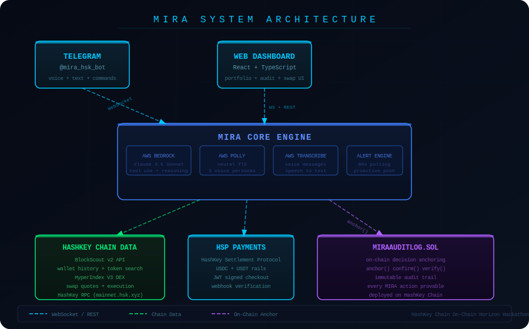
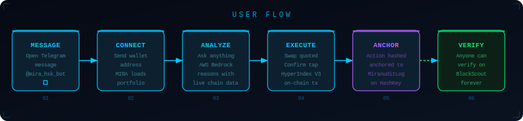
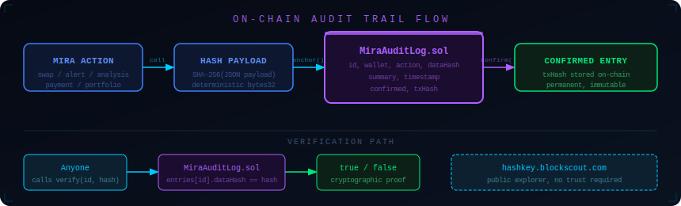

<div align="center">
  <br/>
  <br/>
  <br/>
  <strong>Your on-chain operator for HashKey Chain</strong>
  <br/>
  <br/>
  
  
  
  
</div>

---

MIRA is a Telegram-native DeFi agent for HashKey Chain that executes trades through conversation and anchors every decision on-chain so you can prove what she did.

She lives in your phone, watches your wallet around the clock, and executes trades through natural conversation. No app to install. No dashboard to open. No wallet connect flow. Just a message.

Every decision MIRA makes is anchored on-chain through a custom smart contract deployed on HashKey Chain. You can verify what she did, when she did it, and what the outcome was. This is the first DeFi agent with a provable, immutable audit trail.

Built for the HashKey Chain On-Chain Horizon Hackathon 2026, DeFi track.

---

## The Problem

Every DeFi product makes you go to it. You open an app, connect a wallet, navigate a dashboard, and hope you understand what you are looking at. Most people never bother. The result is 420 million crypto holders who cannot actually use DeFi.

There is a second problem that nobody has solved: you cannot trust an AI agent. MIT studied 30 agentic AI systems in 2026 and found that none of them could stop a rogue action. When an AI agent executes a trade on your behalf, how do you know it did what it said? How do you prove it followed your instructions? How do you audit it later?

MIRA solves both.

---

## The Solution

MIRA flips the interface model. She comes to you, in Telegram, the app already on your phone. You message her like a person. She responds with real on-chain data, executes swaps, and alerts you proactively when something matters.

Every action she takes gets anchored to HashKey Chain through MiraAuditLog.sol. The anchor includes a cryptographic hash of the full action payload, a human-readable summary, a timestamp, and the resulting transaction hash once confirmed. You can verify any entry on BlockScout. The record is permanent and cannot be altered.

---

## Architecture

<div align="center">
  
</div>

## User Flow

<div align="center">
  
</div>

## Audit Trail Flow

<div align="center">
  
</div>

The system has three layers that connect to each other.

The interface layer is Telegram and an optional web dashboard. Both connect to the MIRA backend over WebSocket. The Telegram bot handles text commands, natural language messages, and voice messages. The web dashboard provides a visual portfolio view, token spotlight, swap confirmation, and the on-chain audit history panel.

The intelligence layer is the MIRA backend. It runs AWS Bedrock with Claude 3.5 Sonnet as the reasoning engine, using tool use to call seven DeFi functions. AWS Polly handles text-to-speech with three neural voice options. AWS Transcribe converts voice messages to text. A background alert engine polls HashKey Chain every 60 seconds and pushes proactive messages when holdings move more than five percent.

The chain layer is HashKey Chain. BlockScout v2 provides wallet history, token search, and balance data. HyperIndex V3 handles swap quotes and execution. The HSP adapter creates stablecoin payment links. MiraAuditLog.sol anchors every action permanently.

---

## What MIRA Can Do

Talk to her naturally or use commands. Both work.

**Portfolio intelligence**

Send your wallet address and MIRA loads your complete HashKey Chain portfolio from BlockScout. She calculates PnL per token, identifies idle capital, and summarizes your position in plain language. She greets you with what she sees, not a generic welcome message.

**Token analysis**

Ask about any token on HashKey Chain. MIRA pulls price, 24-hour volume, liquidity depth, holder count, and risk level from HyperIndex and BlockScout. She gives you a direct assessment, not a list of numbers.

**Swap execution**

Say what you want to swap. MIRA gets a quote from HyperIndex V3, shows you the expected output and price impact, and waits for your confirmation. In Telegram, confirmation is a button tap. In the web dashboard, it is a dedicated confirm screen with ethers.js signing. The swap goes on-chain. The result gets anchored to MiraAuditLog.sol.

**Proactive alerts**

MIRA monitors your holdings in the background. When any token you hold moves more than five percent in either direction, she sends you a message without being asked. You do not need to check anything. She tells you.

**Voice messages**

Send a voice message in Telegram. AWS Transcribe converts it to text. MIRA responds with a full DeFi analysis. The transcript appears above her reply so you can see what she heard.

**HSP payments**

Ask MIRA to create a payment link for any amount in USDC or USDT. She generates a HashKey Settlement Protocol checkout URL using JWT-signed requests. The link settles on HashKey Chain.

**Paper trading**

Toggle paper mode in the web dashboard. MIRA runs the same confirm and result flow with a virtual ten thousand dollar balance. Every paper trade still gets anchored to MiraAuditLog.sol so you can review your decisions later.

---

## On-Chain Audit Trail

This is the feature that does not exist anywhere else.

MiraAuditLog.sol is a Solidity contract deployed on HashKey Chain. It stores an immutable record of every action MIRA takes. Each record contains the user wallet address, the action type, a SHA-256 hash of the full action payload, a human-readable summary, a block timestamp, a confirmation flag, and the resulting transaction hash once the action settles on-chain.

The contract exposes four functions. `anchor()` creates a new record and is called by the authorized MIRA agent address. `confirm()` updates a record with the resulting transaction hash after a swap or payment settles. `verify()` checks whether a given data hash matches a stored record, which lets anyone prove that a specific payload produced a specific on-chain entry. `getRecentEntries()` returns the N most recent records for a wallet address.

The web dashboard reads from this contract and displays the full audit history. Every entry links to BlockScout so you can inspect the transaction directly.

Action types recorded: swap executed, swap quoted, alert fired, portfolio analyzed, risk flagged, yield recommended, payment created, strategy triggered.

---

## Technical Stack

**Backend**

The backend is Python with FastAPI and WebSocket support. The core intelligence is AWS Bedrock running Claude 3.5 Sonnet with tool use. Seven DeFi tools are registered: get portfolio, get spotlight, search token, get activity, swap preview, execute swap, and create payment link. The tool dispatcher calls HashKey Chain data functions and anchors every result to MiraAuditLog.sol.

The HashKey Chain data layer is adapted from the Ava Box project by Contrarian3 Labs. It covers HashKey RPC calls, BlockScout v2 API integration, and HyperIndex V3 pool discovery and quote simulation. The HSP adapter is adapted from the OutcomeX project, also by Contrarian3 Labs. It handles JWT signing, cart creation, and webhook verification for HashKey Settlement Protocol.

**Frontend**

The web dashboard is React with TypeScript, built with Vite. Wallet connection uses ethers.js with automatic switching to HashKey Chain (chainId 177). The swap confirmation screen encodes the HyperIndex V3 exactInputSingle calldata and sends the transaction through the connected signer. The audit panel reads from the MiraAuditLog.sol contract via the backend REST endpoint.

**Smart contract**

MiraAuditLog.sol is written in Solidity 0.8.24 and compiled with Foundry. It uses an authorized agent pattern where only registered addresses can write records. The owner can add or revoke agent addresses. The contract has no upgradability and no admin withdrawal functions. Records are permanent.

**Telegram bot**

The Telegram interface uses python-telegram-bot. It handles text commands, free-form natural language, voice messages, and inline keyboard callbacks for swap confirmation. User state including wallet address and conversation history is stored in memory per session.

---

## Project Structure

```
mira/
  backend/
    mira_bot.py              Telegram bot, all command and message handlers
    mira_server.py           FastAPI WebSocket server for web dashboard
    mira_tools.py            Seven DeFi tools with on-chain anchoring
    mira_anchor.py           MiraAuditLog.sol client, web3.py
    mira_alerts.py           Background price alert engine
    mira_swap.py             HyperIndex V3 unsigned transaction builder
    mira_hsp.py              HSP payment link creation
    hashkey_capabilities.py  HashKey RPC, BlockScout, HyperIndex (from Ava Box)
    hashkey_provider.py      Wallet and token data assembly (from Ava Box)
    hashkey_ave_adapter.py   Payload shaping for UI surfaces (from Ava Box)
    hsp_adapter.py           HSP JWT signing and cart creation (from OutcomeX)
    tests/
      test_mira_anchor.py    10 tests for audit anchor module
      test_mira_tools.py     11 tests for DeFi tool dispatch
      test_hashkey_capabilities.py  10 tests for chain data layer

  frontend/
    src/
      App.tsx                Main layout and WebSocket orchestration
      components/
        MiraCharacter.tsx    Animated character with 5 expressions
        DeFiPanel.tsx        Portfolio and watchlist tabs
        SpotlightPanel.tsx   Token detail with mini chart
        SwapConfirm.tsx      Swap confirmation with ethers.js signing
        AuditPanel.tsx       On-chain audit history from MiraAuditLog.sol
        VoiceBar.tsx         Mic input, text input, voice selector
        WalletConnect.tsx    MetaMask with HashKey Chain auto-switch

  contracts/
    src/
      MiraAuditLog.sol       On-chain audit trail contract
    test/
      MiraAuditLog.t.sol     15 Foundry tests
    script/
      Deploy.s.sol           Deployment script for HashKey Chain

  docs/
    logo.svg                 3D retro logo
    architecture.svg         System architecture diagram
```

---

## Running MIRA

**Prerequisites**

- Python 3.10 or later
- Node.js 18 or later
- A Telegram bot token from BotFather
- AWS credentials with Bedrock and Polly access
- A funded wallet on HashKey Chain for contract deployment

**Backend setup**

```bash
cd backend
pip install -r requirements.txt
cp .env.example .env
```

Edit `.env` and add your credentials:

```
TELEGRAM_BOT_TOKEN=your_token_from_botfather
AWS_REGION=us-east-1
AWS_ACCESS_KEY_ID=your_key
AWS_SECRET_ACCESS_KEY=your_secret
BEDROCK_MODEL_ID=anthropic.claude-3-5-sonnet-20241022-v2:0
MIRA_AUDIT_LOG_ADDRESS=deployed_contract_address
MIRA_AGENT_PRIVATE_KEY=your_agent_wallet_private_key
HSP_MERCHANT_ID=optional_for_payfi_track
HSP_PRIVATE_KEY=optional_for_payfi_track
```

Start the Telegram bot:

```bash
python mira_bot.py
```

Start the web dashboard backend:

```bash
python mira_server.py
```

**Frontend setup**

```bash
cd frontend
npm install
npm run dev
```

Open `http://localhost:5173` and connect MetaMask on HashKey Chain.

**Contract deployment**

```bash
cd contracts
forge install foundry-rs/forge-std
forge build
forge script script/Deploy.s.sol \
  --rpc-url https://mainnet.hsk.xyz \
  --broadcast \
  --private-key $DEPLOYER_PRIVATE_KEY
```

Copy the deployed address to `MIRA_AUDIT_LOG_ADDRESS` in your `.env`.

**Running tests**

```bash
cd backend
python -m pytest tests/ -v

cd contracts
forge test -v
```

---

## Demo Flow

Open Telegram and message the bot. MIRA introduces herself with her avatar and a brief description.

Send your wallet address. MIRA loads your full HashKey Chain portfolio from BlockScout and greets you with what she sees. She mentions your total value, your largest position, and anything that looks idle or risky.

Ask her something. Try "any risks in my portfolio?" or "what is the best yield on HashKey Chain right now?" She calls the relevant tools, gets live data, and responds in plain language.

Say "swap 10 USDC for HSK." MIRA gets a quote from HyperIndex V3 and shows you the expected output and price impact. A confirm button appears. Tap it. The swap executes on-chain. MIRA reports the result and anchors the action to MiraAuditLog.sol.

Open the web dashboard. The audit panel shows every action MIRA has taken for your wallet, with timestamps and BlockScout links for confirmed transactions.

---

## What We Built On

The HashKey Chain data layer in this project is adapted from Ava Box by Contrarian3 Labs, which built the first handheld crypto trading terminal on HashKey Chain for this same hackathon. The files hashkey_capabilities.py, hashkey_provider.py, and hashkey_ave_adapter.py come from that project with modifications for the MIRA use case.

The HSP adapter is adapted from OutcomeX, also by Contrarian3 Labs, which built an AI delivery network with on-chain payment settlement on HashKey Chain.

The Telegram-native agent architecture is inspired by OpenClaw, the open-source self-hosted AI agent framework with 247K GitHub stars that demonstrated the power of messaging-native AI agents.

---

## Hackathon Context

This project was built for the HashKey Chain On-Chain Horizon Hackathon 2026, DeFi track, with a submission deadline of April 22, 2026.

The core thesis is that the most important unsolved problem in DeFi AI agents is not capability but trust. Agents can execute trades. What they cannot do is prove what they did. MiraAuditLog.sol is a direct answer to that problem, built on the only SFC-licensed L2 in existence.

The Telegram interface is a direct answer to the adoption problem. DeFi products fail because they require users to come to them. MIRA goes to the user, in the app they already use every day.

*Built for HashKey Chain On-Chain Horizon Hackathon 2026.*
